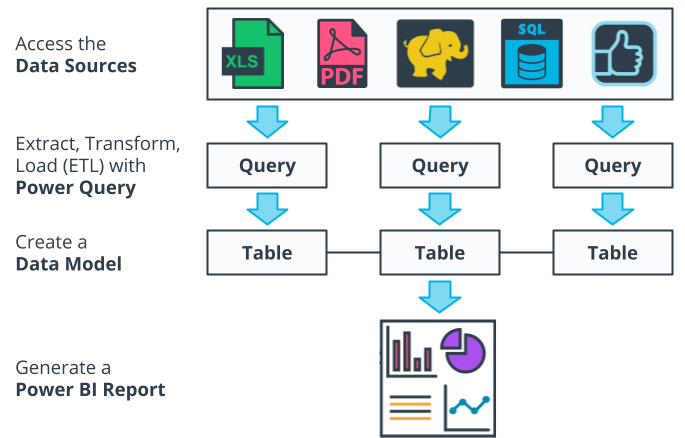
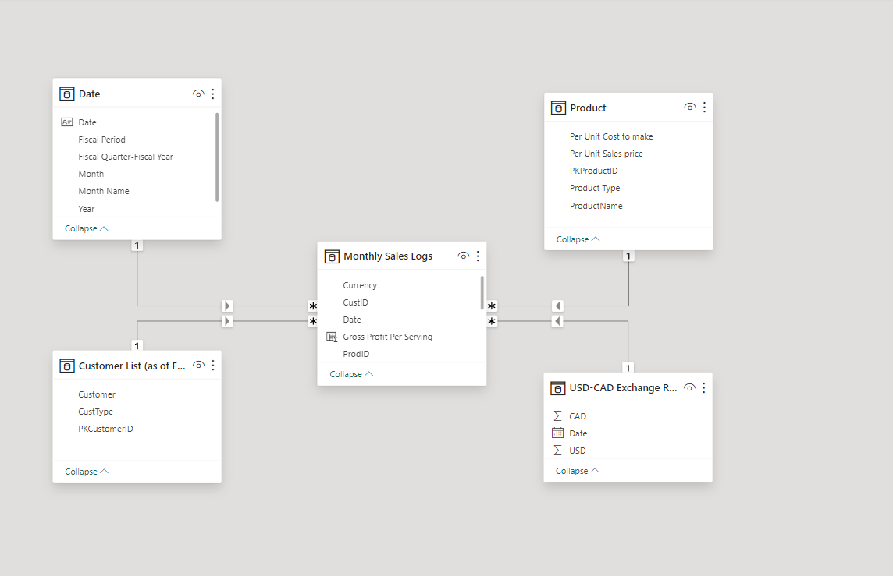

# Seven Sages Tea Company Data Model and Power BI Report Project

## Overview
This project aims to construct a data model and Power BI report for Seven Sages Tea Company (SSTC). The objective is to unify information across all company levels, enabling the CFO to analyze the sales and profitability of different tea beverages effectively.

Key learnings from this course will be utilized to centralize previously isolated data, addressing a prevalent issue in many businesses. This experience will set a robust base for handling more complex visualization, advanced DAX requirements, or larger data models. The core principles stay the same, no matter the data model's size.

## Scenario
As a newly hired junior BI developer for SSTC, located near Seattle, Washington (USA), you are tasked to transform the scattered sales and product data into an actionable format. The goal is to help the owners understand what drives both sales and profitability.

Though it is known that Bamboo Grove Tea is the SSTC's top-selling product, information about the rest of the products is vague. The in-house data collection method leaves uncertainties about the profitability of all products. SSTC's products are sold in Washington State (USD) and British Columbia (CAD), implying a need to consider currency variations. Remember, the company operates on a fiscal calendar which should be incorporated into your data model.

The project's final output should include the following reports:

%20Tab%201.jpeg)
%20Tab%202.jpeg)

## Main Steps
Here are the critical steps involved in this project, each of which will be discussed in greater detail in the upcoming sections:

1. **Source files**: Download and familiarize yourself with the provided SSTC source files.
2. **Sketch the data model**: Outline your intended data model.
3. **Use Get Data**: Load the starter materials' data into Power BI using Get Data.
4. **Structure, combine, and clean the data**: Clean and format your data to ensure its compatibility with your data model.
5. **Create your date table**: Build a date table to enable time intelligence.
6. **Build relationships between your tables**: Establish a relationship from each dimension to the relevant key on the fact table.
7. **Write your measures**: Write six measures to calculate Sales, Cost of Sales, and Gross Profit Margin in both USD and CAD.
8. **Create a report**: Build a visual report to showcase your findings.

The project steps align with the main steps of the Power BI pipeline:

## Suggestion 1: Product Type
So far, we've helped the CFO better understand how sales and profitability translate by customer and we've learned more about profitability relative to sales by each tea.

Next, we want to dig in a little deeper and figure out what product type is most profitable per serving for serving for SSTC beverages.

## Tables after Cleaning and Formatting Data
### Customers List

### Products

### Monthly Sales Logs

### Date Table

### USD-CAD Exchange Rates

## The Project Model
### Project Model

## Reporting Layer

The reporting layer of this project consists of three tabs:

### Tab 1

This tab includes:

- Two card visualizations
- One matrix
- A text box providing an executive summary of key findings

The total figures in Tab 1 are:

- Total Sales in USD: $167.57K
- Total Sales in CAD: $224.21k
- % Gross Profit Margin in USD (Year total): 14.7%

All values are properly formatted and clearly labeled. Fiscal quarters, not calendar quarters, are used for time periods.

### Tab 2

Tab 2 contains a simple table with three columns. The columns show the Sales, the percentage of sales, and the percentage of gross profit contributed by each tea beverage produced by SSTC. The total shows total Sales and 100% for PCT.

### Tab 3 

Tab 3 contains a simple table to determine the most profitable per serving for SSTC beverages By Product Type

## Final Report Screenshots

###  Tab 1 - Sales and GPM

###  Tab 2 SSTC-Gross Profit and Unit Sales

###  Tab 3 Most Profitable Per Serving for SSTC beverages by Product Type

